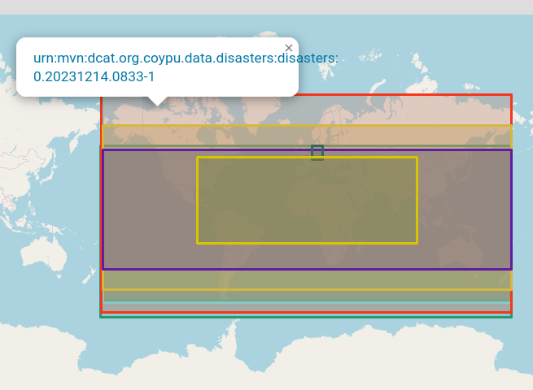
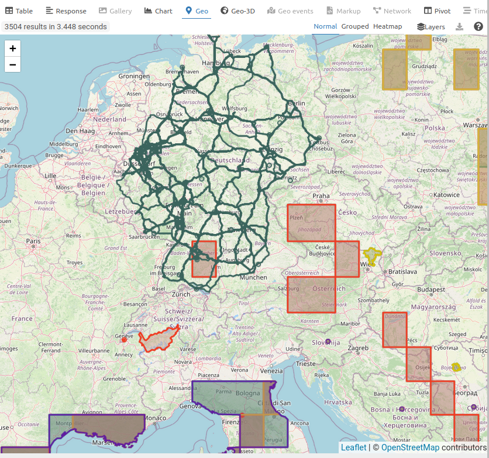

# aksw-data-deployment
A maven pom.xml file with common settings for deploying data artifacts to the AKSW infrastructure.

You can use this pom as a parent for data deployment projects:

```xml
<?xml version="1.0" encoding="UTF-8"?>
<project xsi:schemaLocation="http://maven.apache.org/POM/4.0.0 https://maven.apache.org/xsd/maven-4.0.0.xsd" xmlns="http://maven.apache.org/POM/4.0.0" xmlns:xsi="http://www.w3.org/2001/XMLSchema-instance">
  <modelVersion>4.0.0</modelVersion>
  <parent>
    <groupId>org.aksw.data.config</groupId>
    <artifactId>aksw-data-deployment</artifactId>
    <version><!-- check version --></version>
    <relativePath></relativePath>
  </parent>
  <packaging>pom</packaging>
  <!-- ... -->
</project>
```

The available versions are listed [here](https://maven.aksw.org/archiva/#artifact/org.aksw.data.config/aksw-data-deployment).


<table>
  <tr>
    <td>
      <pre>
<![CDATA[
PREFIX rdfs: <http://www.w3.org/2000/01/rdf-schema#>
PREFIX eg: <http://www.example.org/>
PREFIX rdf: <http://www.w3.org/1999/02/22-rdf-syntax-ns#>
PREFIX dcterms: <http://purl.org/dc/terms/>
PREFIX locn: <http://www.w3.org/ns/locn#>
PREFIX dcat: <http://www.w3.org/ns/dcat#>

SELECT * {
  # Select a reasonably sized subset of the datasets
  { SELECT * {
    GRAPH ?dcatMvnUrn {
      ?s
        eg:groupId ?g ; eg:artifactId ?a ; dcat:version ?v ;
        dcat:bbox ?o ;
        .
    }
  } LIMIT 10 }

  # Compute colors, links, labels, and tooltips
  BIND(CONCAT("#", SUBSTR(MD5(STR(?dcatMvnUrn)), 0, 7)) AS ?oColor)
  BIND("https://maven.aksw.org/archiva/#artifact-details-download-content/" AS ?baseUrl)
  BIND(CONCAT(?baseUrl, ?g, "/", ?a, "/", ?v) AS ?link)
  BIND(STRDT(CONCAT(
    '<a target="_blank" href="', ?link, '">', STR(?dcatMvnUrn), '</a>'
  ), rdf:HTML) AS ?oLabel)
  BIND(?oLabel AS ?oTooltip)
}
]]>
      </pre>
    </td>
    <td>
      
    </td>
  </tr>

  <tr>
    <td>
      <pre>
<![CDATA[
PREFIX eg: <http://www.example.org/>
PREFIX geo: <http://www.opengis.net/ont/geosparql#>
PREFIX locn: <http://www.w3.org/ns/locn#>
PREFIX dcat: <http://www.w3.org/ns/dcat#>

SELECT ?dcatMvnUrn ?o ?oColor ?oLabel ?oTooltip ?file {
  # Select a reasonably sized subset of the datasets
  { SELECT * {
    GRAPH ?dcatMvnUrn {
      ?s
        eg:groupId ?g ; eg:artifactId ?a ; dcat:version ?v ;
        dcat:bbox ?bbox ;
        dcat:distribution/dcat:downloadURL ?downloadUrl ;
        .
    }
  } LIMIT 10 }
  BIND(IRI(CONCAT("cache:vfs:", STR(?downloadUrl))) AS ?serviceUrl)
  LATERAL {
    SERVICE ?serviceUrl {
      SELECT ?o ?e {
        ?geom ?p ?o
        FILTER(DATATYPE(?o) = geo:wktLiteral)
        #?geom geo:asWKT ?o .
        OPTIONAL { ?feature geo:hasGeometry ?geom }
        BIND(COALESCE(?feature, ?geom) AS ?e)
      } LIMIT 1000
    }
  }
  BIND(CONCAT("#", SUBSTR(MD5(STR(?dcatMvnUrn)), 0, 7)) AS ?oColor)
  BIND("https://maven.aksw.org/archiva/#artifact-details-download-content/" AS ?baseUrl)
  BIND(CONCAT(?baseUrl, ?g, "/", ?a, "/", ?v) AS ?link)
  BIND(STRDT(CONCAT(
    '<p>', STR(?e), '</p>',
    'Source: <a target="_blank" href="', ?link, '">', STR(?dcatMvnUrn), '</a>'
  ), rdf:HTML) AS ?oLabel)
  BIND(?oLabel AS ?oTooltip)
}
]]>
      </pre>
    </td>
    <td>
      
    </td>
  </tr>
</table>


## Creating a release

For internal use. Deploys this pom to maven central. Requires the AKSW gpg key.

In order to create a github release, on `develop` branch run

```
git checkout develop
mvn gitflow:release-start gitflow:release-finish
```

If this succeeds, switch to the `main` branch and run

```
git checkout main
mvn -Prelease deploy
```

### Trouble Shooting

* If you see an error such as the one below then make sure your docker environment is available.
```
Execution run-container of goal io.fabric8:docker-maven-plugin:0.43.4:build failed:
No <dockerHost> given, no DOCKER_HOST environment variable, no read/writable '/var/run/docker.sock'
or '//./pipe/docker_engine' and no external provider like Docker machine configured
```

### Help

Display properties of a `pom.xml` after loading `.properties` and `.json` files:
```
mvn initialize help:evaluate -Dexpression=project.properties -q -DforceStdout
```
