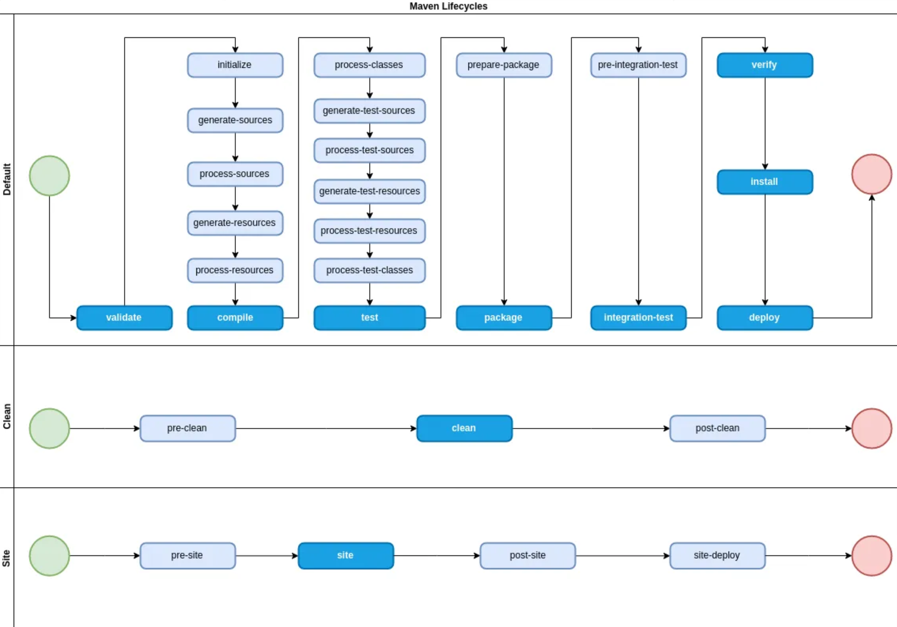

# An Introduction to Maven

Maven is a build tool centered around the ideas that:

* All aspects of a *project* can be abstracted into the *project object model* (POM). The files containing project information are thus called `pom.xml`.
* Different aspects of a project's *build process* can be captured as *life cycles* which are sequences of *phases*.

Given a project with `pom.xml` file, most Maven users will only use a very limited set of phases, the typical ones most likely being the following:

* First clean a project, then build everything and copy the build outcome into the local maven repository:
```bash
mvn clean install
```

* Deploy the build outcome to a target configured in the `pom.xml`.
```
mvn deploy
```

## Overview of Phases

The image below is taken from [this excellent introductory post](https://medium.com/@yetanothersoftwareengineer/maven-lifecycle-phases-plugins-and-goals-25d8e33fa22) and captures the essence nicely: It shows the three life cycles *default* , *clean* and *site*, and the corresponding sequence of phases, whereas the dark blue ones are the most relevant ones.

Note the phase *generate-resources* which can be used to generate data and *process-resources* which is intended to make it ready for packaging.

The `pom.xml` file captures a model of your project. The point that is crucial to the understanding is expressed in the bold statement cited from  https://maven.apache.org/pom.html:

> The Maven POM is big. However, its size is also a testament to its versatility. **The ability to abstract all of the aspects of a project into a single artifact is powerful, to say the least**. Gone are the days of dozens of disparate build scripts and scattered documentation concerning each individual project.

Within a pom.xml you can use any number of Maven plugins to execute code to alter virtually any aspect of your project. Plugins are can do data and code generation, packaging, deployment or alter the `pom.xml` itself.



<sub>Image source: https://medium.com/@yetanothersoftwareengineer/maven-lifecycle-phases-plugins-and-goals-25d8e33fa22</sub>

## Plugins and Goals

A phase does not do anything by itself. Plugins are the components that provide the logic for doing actual work.
Technically, a plugin is a JAR file with meta-information for Maven.
The set of operations a plugin supports is called *goals*.

Invoking maven with the name of a phase runs all plugins' goals that are *bound* to it.
The declaration of which plugin's goal to execute in which phase is part of the `pom.xml` file.

👉 This means, that for any missing feature in a build life cycle one should consider whether its worth writing a plugin for it (if one doesn't already exist). Such an approach might be more sustainable than custom scripts.

