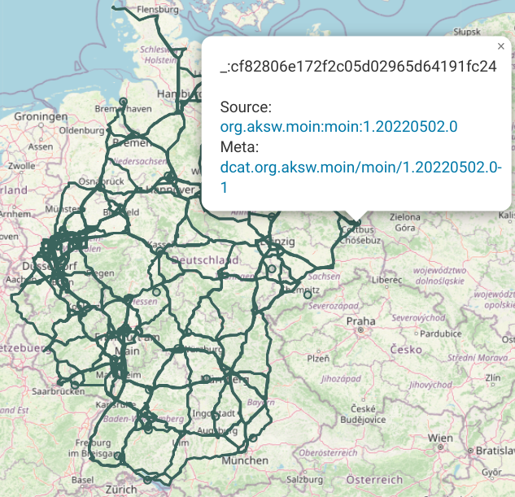
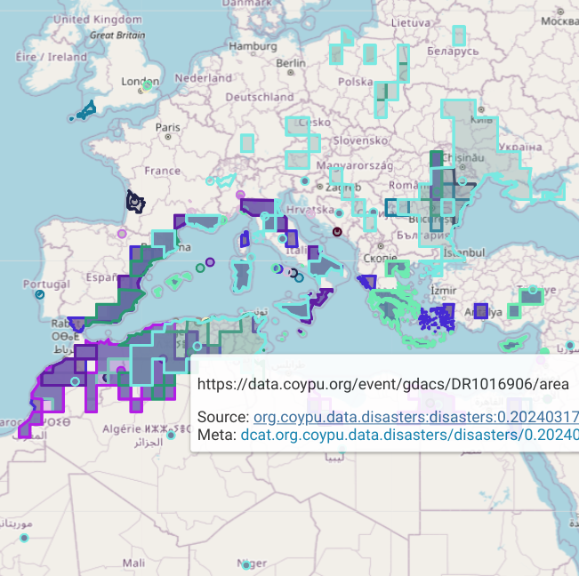

# Online Demo

These are Links to [YasGUI](https://yasgui.triply.cc/) visualizations for [our SPARQL endpoint](https://maven.aksw.org/sparql).

The SPARQL endpoint contains metadata about RDF datasets in [our Archiva Artifact Repository](https://maven.aksw.org/).
We are deploying datasets to the artifact repository using Maven deploments (`mvn deploy`) and manual uploads. Currently we do not provide a public upload service.
Once artifacts are uploaded to the repository, the [mvn-rdf-sync](sync/index.md) system automatically generates metadata artifacts, which are published in our SPARQL endpoint.
Note, that published data contains links to the `pom.xml` files in the archiva, of which some(\*) are self-contained such that they re-produce the output from the inputs.

\* The POM does not have native support for such metadata, we intent to introduce the following Maven and RDF properties in the metadata:

*`m4d:self-contained` to indicate that the POM is intended to support running it stand-alone in order to produce one or more output artifacts, and
*`m4d:reproducible` when each run is supposed to produce the exact same output bit-by-bit.

## Links

* [Mobility Index Data](https://api.triplydb.com/s/24BRwf-Ef)

* [Disasters Data](https://api.triplydb.com/s/17MgzHpWq)

