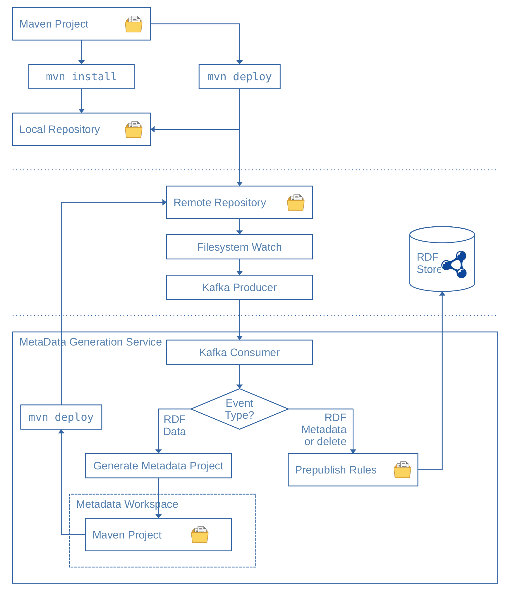

# Mvn Sync Architecture

## Source Code

The source code for `mvn-rdf-sync` is located at: https://github.com/Scaseco/mvn-rdf-sync

## Synopsis

## Purpose

## Abstract Approach

### Concrete Approach

